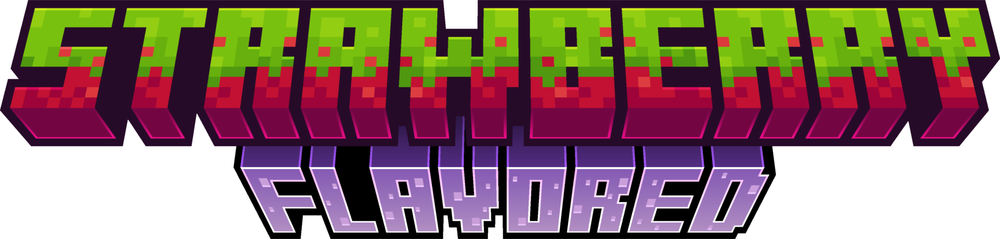
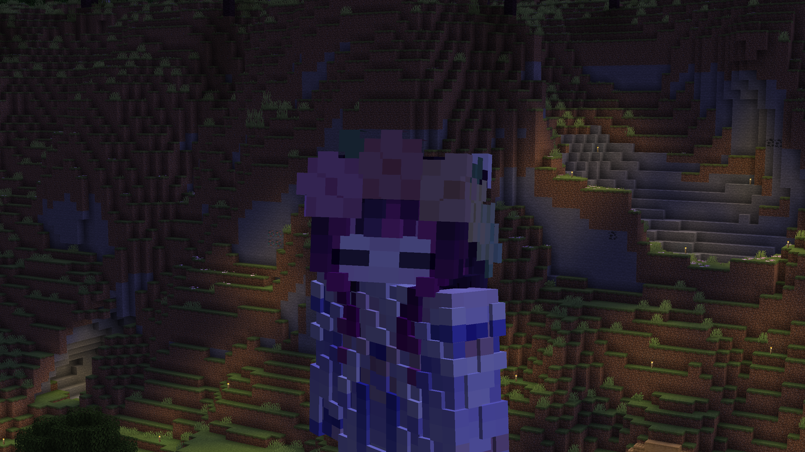
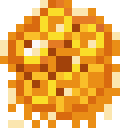
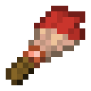

  

  A collection of small quality-of-life features for Minecraft.
  Everything is server-side; clients do not need Strawberry Flavored installed.

## Features

<strong>Armor Trim Buffs</strong>

- A full four-piece set with the same trim material is required.
- The trim pattern does not matter.
- Redstone trim material grants Regeneration I.
- Lapis and quartz trim materials grant Speed I.
- Other trim materials currently have no bonus.

<strong>Anti-Crop Trampling</strong>

- Boots with the Feather Falling enchantment will not trample crops.
- Leather Boots have this effect inherently.

<strong>Flower Crown</strong>

  

- Crafted with smaller flowers around a piece of string.

  

<strong>Happy Ghast Treats</strong>

  

- Shapeless recipe: Honeycomb, Honey Bottle, and Sugar.
- Treats increase the speed of Happy Ghasts for five minutes.
- Feeding a Happy Ghast again resets the timer.

<strong>Dyed Brushes</strong>

  

- Shapeless recipe: a vanilla brush and any dye.
- Hold right-click to paint wool, carpet, beds, terracotta, concrete, concrete powder, glass, glass panes, candles, shulker boxes, or banners.
- Each dyed brush has 64 uses.

<strong>Soul Hearts and Soul Shards</strong>

  

- Soul Hearts are crafted from a Soul Shard, Blaze Rod, Breeze Rod, and Glow Berries.
- Soul Hearts provide `keepInventory=true` when consumed.

  

- Soul Shards can be duplicated like a template, using a Sculk Catalyst as the base block.

<strong>Major Event Titles</strong>

- Major events, such as summoning the Wither or entering the End, display an on-screen title.

## Versioning / GitHub

- The version in `gradle.properties` looks like `26.3-1.6`: Minecraft version, then mod version.
- A commit containing `[build]` runs CI without changing the version.
- A commit containing `[release]` runs CI and, when pushed to `main`, bumps the last number (`26.3-1.6` → `26.3-1.7`) and commits it.
- Commits without `[build]` or `[release]` do not run the workflow.
